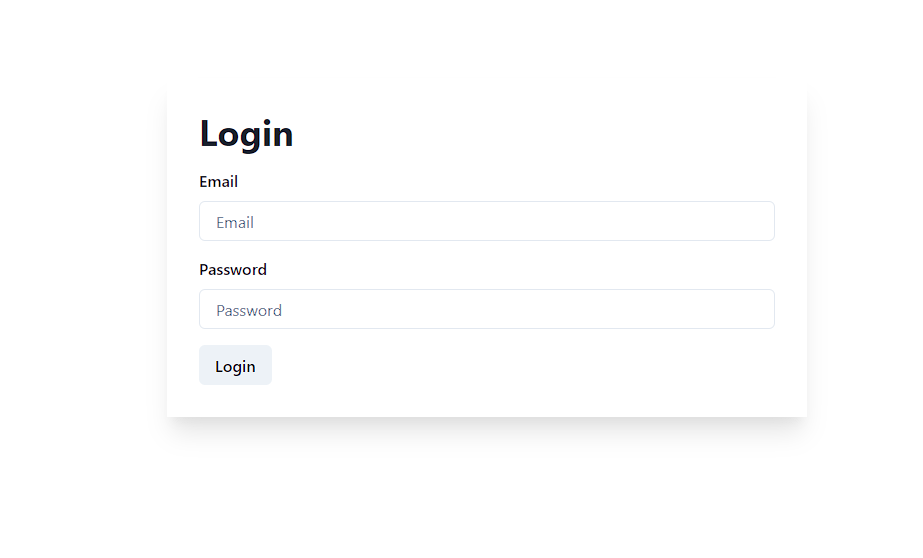
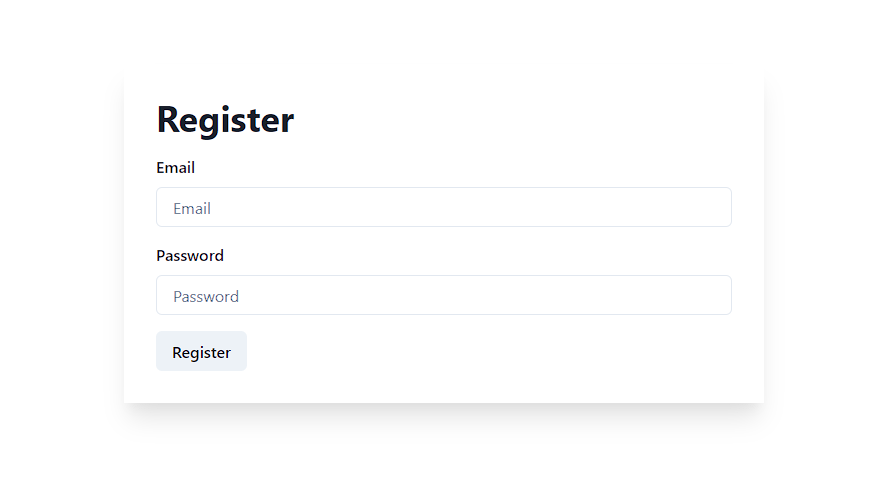
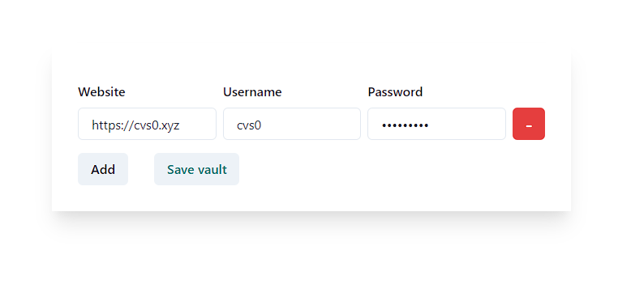
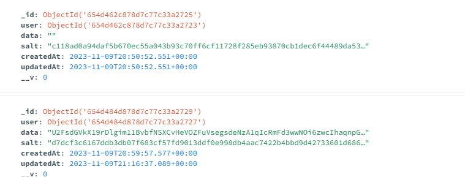

# LockScript: Ultra-Secure Password Manager

LockScript is an advanced, server-client password manager developed with cutting-edge technologies, including Next.js, React.js, Node.js, Fastify, and TypeScript.

## Table of Contents
- [Features](#features)
- [Getting Started](#getting-started)
- [Database Setup](#database-setup)
- [Contributing](#contributing)
- [Pull Request Requirements](#pull-request-requirements)
- [Roadmap](#roadmap)
- [FAQ](#frequently-asked-questions-faq)
- [Media](#media)
- [License](#license)
- [Support](#support)

## Features

* **Security First:** LockScript prioritizes the security of your passwords, ensuring top-notch protection for your sensitive information.
* **User-Friendly Interface:** The sleek and intuitive design makes password management easy for both beginners and advanced users.
* **Technology Stack:**
    * **Next.js:** Utilizing the power of Next.js for a fast and efficient web application.
    * **React.js:** Creating a dynamic and responsive user interface.
    * **Node.js:** Leveraging the scalability and performance of Node.js for server-side development.
    * **Fastify:** Ensuring high-speed server performance with the Fastify web framework.
    * **TypeScript:** Adding static typing to the mix for enhanced code quality and productivity.

## Getting Started

1. **Clone the repository:**
    ```bash
    git clone https://github.com/cvs0/LockScript.git
    ```

2. **Install Dependencies:**
    ```bash
    cd LockScript
    cd client
    npm install
    cd ..
    cd server
    npm install
    ```

3. **Run the Client:**
    ```bash
    cd client
    yarn dev
    ```

4. **Run the Server:**
    ```bash
    cd ..
    cd server
    yarn dev
    ```

Visit `http://localhost:3000` in your browser to access the LockScript client.

## Database Setup

1. **Download MongoDB:**
    * [Download MongoDB](https://www.mongodb.com/try/download/community).

2. **Setup MongoDB:**
    * Go through the setup wizard completely.

3. **Create a new database**
    * Create a database with the name `password-manager`.

## Contributing

We welcome contributions from the community. If you'd like to enhance LockScript, please follow our [Contribution Guidelines](https://github.com/cvs0/LockScript/CONTRIBUTING.md).

## Pull Request Requirements
1. **Code Quality:**
    * Ensure your code follows our coding standards and practices.
2. **Documentation:**
    * Provide clear and concise documentation for any new features or changes.
3. **Testing:**
    * Include relevant tests for your changes and ensure all existing tests pass.
4. **Branch Naming:**
    * Use a descriptive branch name that reflects the nature of your changes.
5. **Commit Message:**
    * Write clear and meaningful commit messages, summarizing the purpose of each commit.
6. **License Compatibility:**
    * Ensure that any new code is compatible with the projects MIT License.
7. **Issues:**
    * Link your pull request to any related issues in the repository.

## Roadmap

#### Version 2.1 (Upcoming Release)

- Fully featured landing page.
- Fully redone client using NextJS 14 + Tailwind CSS
- Updating all dependencies and addressing all security concerns

#### Version 2.2
- Fully redone auth with Clerk (with OAuth integration)

#### Version 2.3
- Full security blog

#### Version 2.3.1
- All open bugs will be patched in this release.

#### Version 2.3.2
- Small patches

#### How to Contribute to the Roadmap

We encourage the community to share feedback and suggest features. Please open an issue to propose new ideas or upvote existing issues to help prioritize development efforts.

## Frequently Asked Questions (FAQ)

#### Q: Is LockScript suitable for personal use?
A: Absolutely! LockScript is designed for both personal and professional use, providing a secure and user-friendly password management solution.

#### Q: How do I set up LockScript?
A: You need to regenerate the `public.key` and `private.key`, using [this site](https://travistidwell.com/jsencrypt/demo/) and update all instances of the `secure` property in the server config, (`constants.ts`). (only if you are using TLS).

## Media





## License

LockScript is licensed under the [MIT License](https://github.com/cvs0/LockScript/blob/main/LICENSE), ensuring open collaboration and flexibility.

## Support

If you encounter any issues or have questions, feel free to [open an issue](http://github.com/cvs0/LockScript/issues) on the repository.